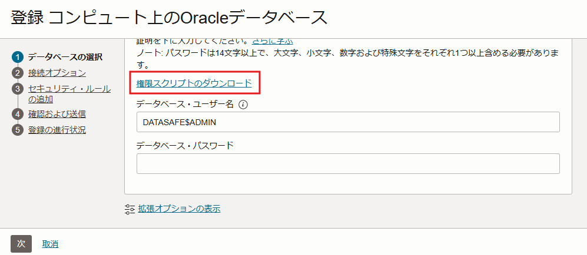
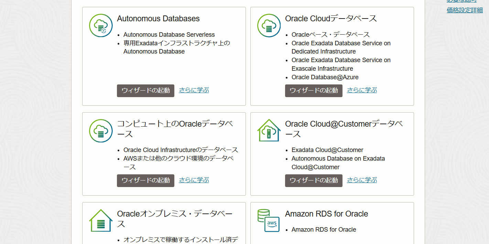
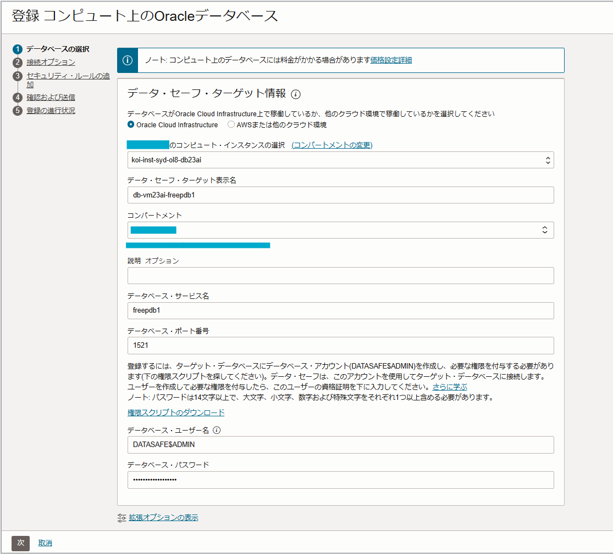
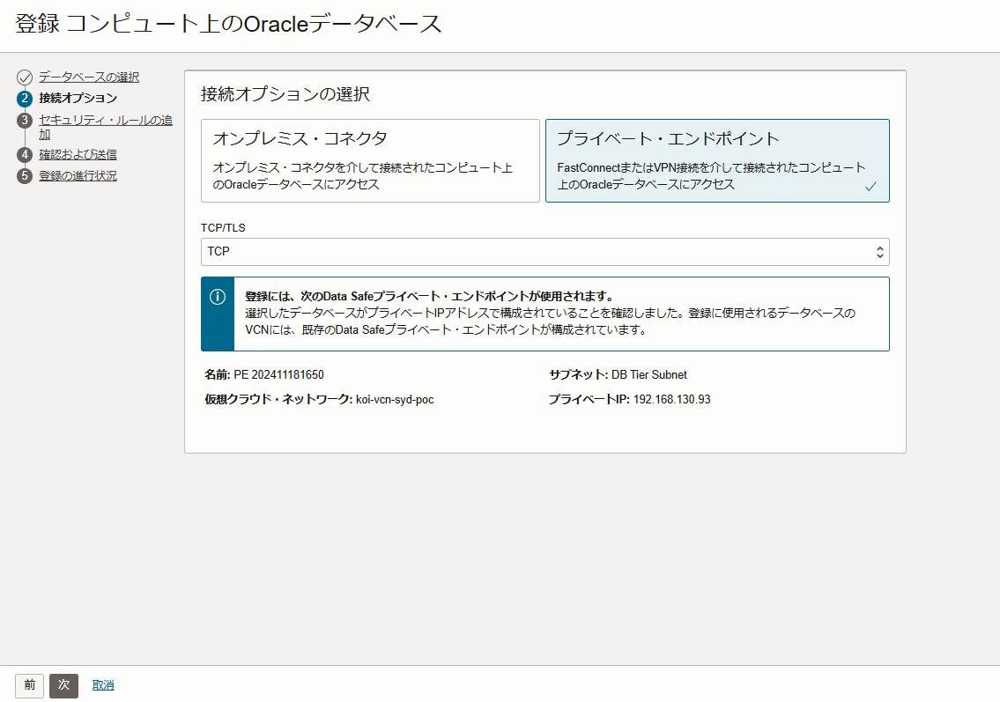
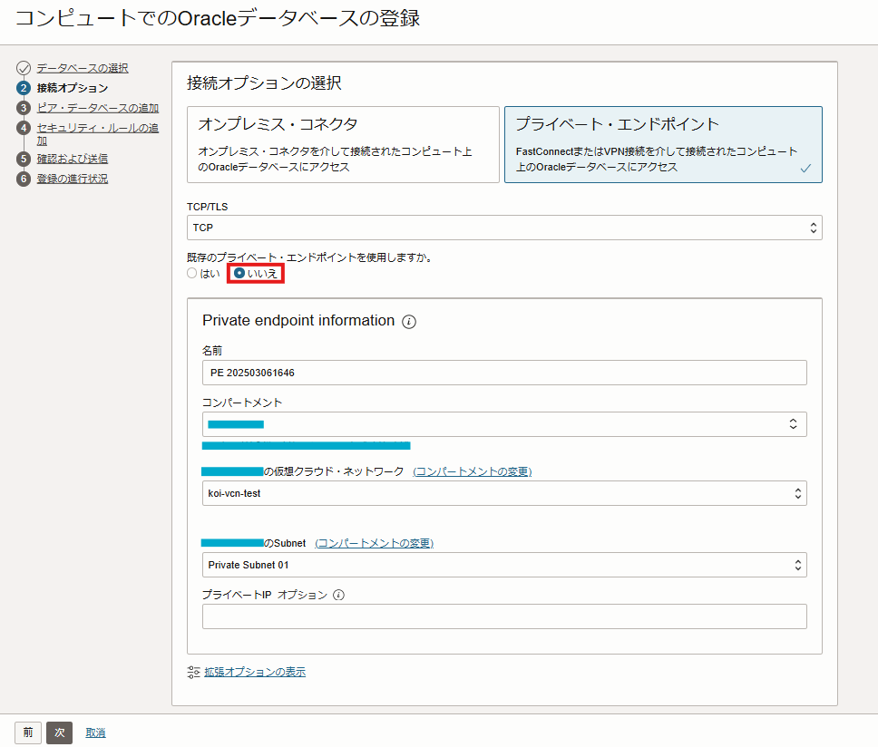
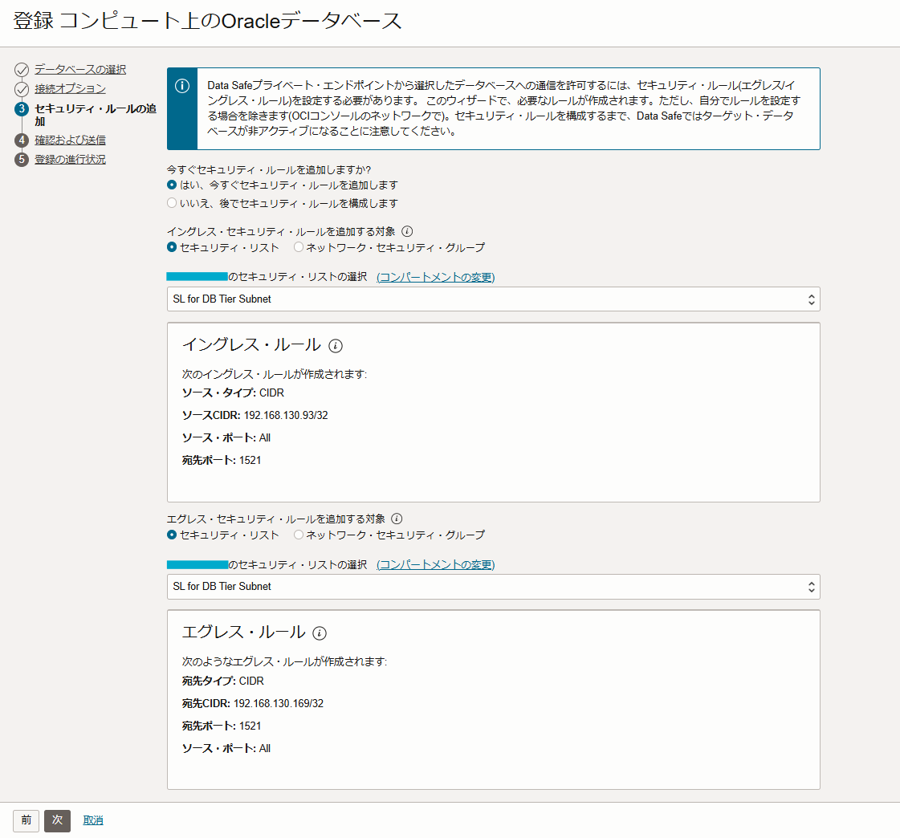
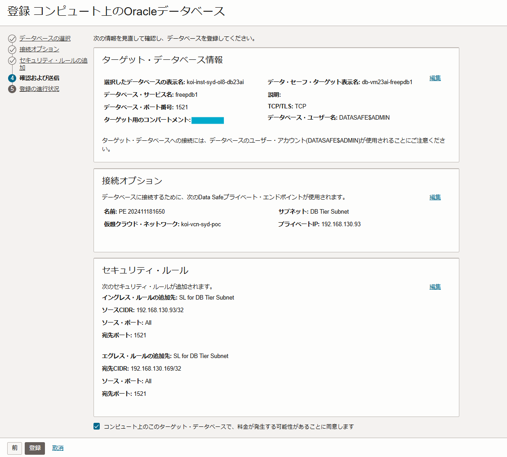
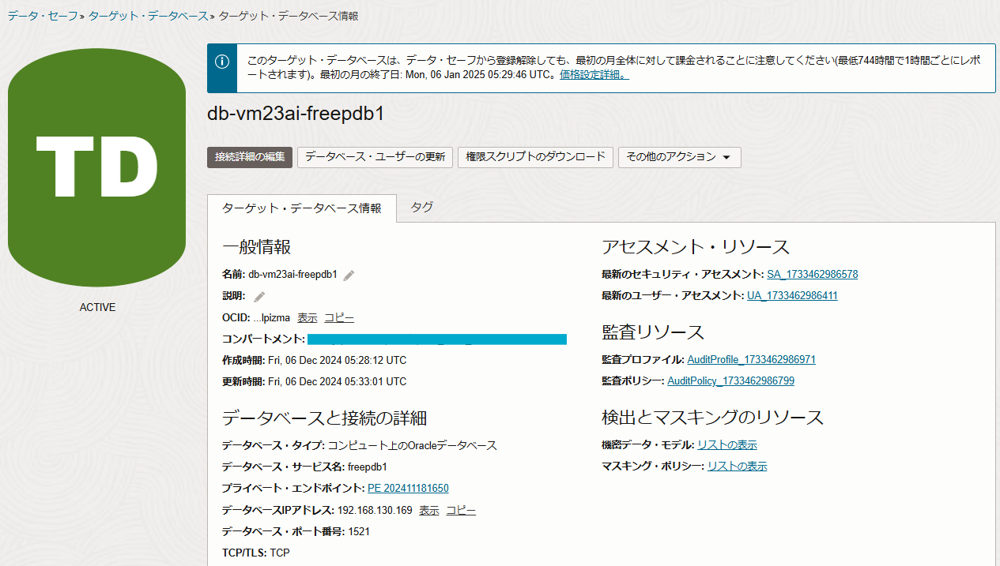

############################################
1. Data Safeの準備
############################################

.. topic:: 実施内容

    + Data Safe用のDBユーザー"DATASAFE$ADMIN"を作成
    + OCIコンソール

| Oracle Data Safeは、Oracle Databaseのセキュリティを強化するためのクラウドサービスです。
| エージェント不要で、OCIコンソールから以下のセキュリティ関連の操作を行えます。

+ セキュリティ評価（セキュリティ評価、ユーザー評価）
+ ユーザーのアクティブ監視
+ 監査ログの可視化
+ 機密データの検出
+ マスキングデータの作成
+ SQLファイアウォールの設定・管理（ターゲットDBが23aiのときのみ）

| Data Safeは、オンプレミスや他社クラウドのOracle Databaseも対象にできます。
| また、OCIのDatabaseサービスを利用する場合、基本的に無償でつかえます。

関連リンク： `Data Safeの機能詳細 - Speaker Deck <https://speakerdeck.com/oracle4engineer/oracle-data-safefalseji-neng-gai-yao-tote-zheng>`__

| 本手順ではOCI上にDB23aiがのった仮想マシンに対しての登録ケースを想定していますが、OCIのDBクラウドサービスであるBaseDBもほぼ同様の手順で設定可能です。
| Autonomous Databaseの場合は少し手順が異なりますので、以下を参考にしてみてください

- `Oracle Data SafeでAutonomous Databaseを管理する #Security - Qiita <https://qiita.com/western24/items/b772d95148b8855b8bb0>`__

****************************
DATASAFEユーザーの作成
****************************
Oracle公式の登録手順：https://docs.oracle.com/cd/E83857_01/paas/data-safe/admds/target-database-registration.html

Data Safe用のDBユーザーとして ``DATASAFE$ADMIN`` を作成します。
このユーザーの名前は自由ですが、OCIコンソールでの登録画面では ``DATASAFE$ADMIN`` ユーザー名がデフォルトでセットされてるため、この名前を使用しています。

.. code-block:: sql
    :caption: ユーザーを作成（PDB）

    CREATE USER DATASAFE$ADMIN IDENTIFIED BY "<password>"
    DEFAULT TABLESPACE "USERS"
    TEMPORARY TABLESPACE "TEMP";

.. code-block:: sql
    :caption: 権限を付与（細かな権限はこの後別途スクリプトで付与します）

    GRANT CONNECT, RESOURCE TO DATASAFE$ADMIN;

.. important::

    | SYSTEMまたはSYSAUXをデフォルト表領域として使用しないでください。 
    | これらの表領域を使用している場合は、データをマスキングできません。

.. note::

    | Autonomous Database（以下ADB）の場合、 ``DS$ADMIN`` というユーザーがすでに作成されています。
    | そのため、別途作成する必要はありませんが、このユーザーはロックされているのでアンロックする必要があります。また、ADBが登録解除されると再度ロックされます。

******************************************
DATASAFEユーザーにロールを追加する
******************************************

ドキュメントリンク：https://docs.oracle.com/cd/E83857_01/paas/data-safe/admds/grant-roles-oracle-data-safe-service-account-your-target-database.html

non-ADBの場合、スクリプト ``datasafe_privileges.sql`` を実行することで、ロールを付与または取り消しができます。
このスクリプトはOCIコンソールの [メニューバー] → [Oracle Database] → [データ・セーフ - データベース・セキュリティ] と移動し、「ターゲットDBの登録」ボタンを選択した画面から入手することができます。

DBサーバーにスクリプトファイルを移し、SQL*Plusで接続。以下のコマンドで実行すると、上記画像のすべての権限を付与し、すべてのOracle Data Safe機能が使用可能になります。

.. code-block:: sql

    @datasafe_privileges.sql <DataSafeユーザー> GRANT ALL -VERBOSE

.. seealso:: 構文
    sqlスクリプトの構文は以下の通りです。

    .. code-block:: sql

        @datasafe_privileges.sql <DATASAFE_ADMIN> <GRANT|REVOKE> <AUDIT_COLLECTION|AUDIT_SETTING|DATA_DISCOVERY|MASKING|ASSESSMENT|ALL> [-RDSORACLE][-VERBOSE]

    今回はData Safeのすべての機能を使用する権限を与えるため ``ALL`` を選択していますが、上記の通りData Safeの特定の機能に必要な権限だけを与えるもしくは剥奪することも可能です。

.. code-block:: sql
    :caption: 実行例

    SQL> @datasafe_privileges.sql DATASAFE$ADMIN GRANT ALL -VERBOSE
    Enter value for USERNAME (case sensitive matching the username from dba_users)
    Setting USERNAME to DATASAFE$ADMIN
    Enter value for TYPE (grant/revoke)
    Setting TYPE to GRANT
    Enter value for MODE (audit_collection/audit_setting/data_discovery/masking/assessment/sql_firewall/all)
    Setting MODE to ALL

    Granting AUDIT_COLLECTION privileges to "DATASAFE$ADMIN" ...
    CREATE ROLE "ORA_DSCS_AUDIT_COLLECTION"
    GRANT CREATE SESSION to "ORA_DSCS_AUDIT_COLLECTION"
    GRANT AUDIT_VIEWER TO "ORA_DSCS_AUDIT_COLLECTION"
    GRANT READ ON SYS.DBA_AUDIT_MGMT_CLEANUP_JOBS TO "ORA_DSCS_AUDIT_COLLECTION"
    GRANT READ ON SYS.V_$PWFILE_USERS TO "ORA_DSCS_AUDIT_COLLECTION"
    GRANT READ ON SYS.DBA_TABLES TO "ORA_DSCS_AUDIT_COLLECTION"
    GRANT SELECT ON SYS.DUAL TO "ORA_DSCS_AUDIT_COLLECTION"
    GRANT READ ON SYS.V_$OPTION TO "ORA_DSCS_AUDIT_COLLECTION"
    GRANT EXECUTE ON SYS.DEFAULT_JOB_CLASS TO "ORA_DSCS_AUDIT_COLLECTION"
    GRANT EXECUTE ON SYS.DBMS_OUTPUT TO "ORA_DSCS_AUDIT_COLLECTION"
    GRANT READ ON SYS.STMT_AUDIT_OPTION_MAP TO "ORA_DSCS_AUDIT_COLLECTION"
    GRANT EXECUTE ON SYS.XMLTYPE TO "ORA_DSCS_AUDIT_COLLECTION"
    ...
    GRANT AUDIT_VIEWER TO "ORA_DSCS_ASSESSMENT"
    GRANT CAPTURE_ADMIN TO "ORA_DSCS_ASSESSMENT"
    GRANT SELECT ON AUDSYS.AUD$UNIFIED TO "ORA_DSCS_ASSESSMENT"
    GRANT "ORA_DSCS_ASSESSMENT" to "DATASAFE$ADMIN"
    Disconnected from Oracle Database 23ai Free Release 23.0.0.0.0 - Develop, Learn, and Run for Free
    Version 23.6.0.24.10

.. tip::
    
    | ADBとnon-ADBで追加されるロールが異なります。
    | また、ADBでは ``DS$DATA_MASKING_ROLE`` 以外のすべてのロールがすでにデフォルトで付与されています。

    .. figure:: ./_img/ロール.png

******************************************
Data SafeにDBを登録する
******************************************

Data Safeの画面より、該当するターゲットDBの「ウィザードの起動」を選択します。今回はコンピュート上の23ai FREEをターゲットとするので、「コンピュート上のOracleデータベース」を選択した手順となります。

.. hint::

    「ウィザードによるデータベースの登録」からDBを登録すると、プライベートエンドポイントの作成とセキュリティ・リストまたはネットワーク・セキュリティ・グループの設定を同時に行うことができます。

ターゲット・データベース情報を入力する画面では以下の項目を入力します。

:サービス名: FREEPDB1
:ポート番号: 1521

|
| 続いての画面ではDBとData Safeの接続口、プライベートエンドポイントを作成する画面となります。プライベート・エンドポイントは1つのVCNにつき1つしか作成できないため、すでに作成されている場合はそちらを使用してください。
| 作成していない場合は「既存のプライベート・エンドポイントを使用しますか。」で「いいえ」を選択することで、この画面から直接作成することができます。

    
    すでにプライベートエンドポイントがある時の画面

    新規にプライベートエンドポイントを作成する時の画面

次にファイアウォール（セキュリティ・リストまたはネットワーク・セキュリティ・グループ）の設定を行うことができます。

最後に項目を確認し、「登録」をクリックします。

そして無事登録され、ステータスが「ACTIVE」になっていることを確認します。

以上でData SafeへのDB登録は終了です。