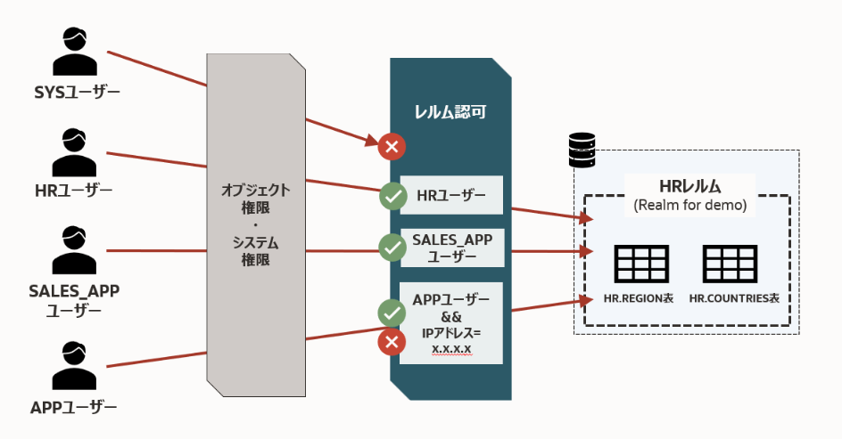
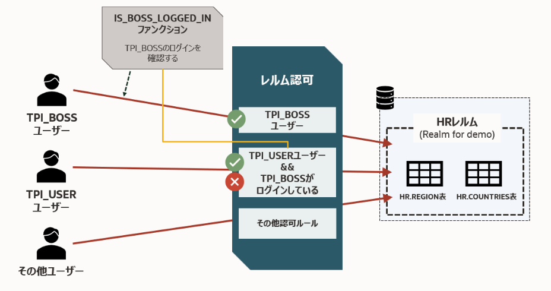

###########################
0. イントロダクション
###########################

このページでは、Oracle Database の Database Vault についての簡単な説明と、そのサイトにて行う手順の流れを説明します。

***************************************************
Database Vaultとは
***************************************************

Oracle Database Vaultは、Oracle Database Enterprise Editionに付属するセキュリティ機能の一つで、特権ユーザーによる不正アクセスや操作を防止し、データベース内部での強力な分離制御を実現します。
Oracle Database Cloudサービスでは「High Performance」以上のエディションにてお使いいただけます。

主な機能として「レルム」を使ったスキーマおよびオブジェクトへのアクセス制限、「コマンド・ルール」によるSQLクエリの制御等があります。
これらの制御機能により、DBAなどの強力な権限を持つユーザーの操作に対しても制限することができ、大規模組織での分掌管理や規制対応が容易になります。

***************************************************
このサイトで行う手順の流れ
***************************************************

Database Vaultを体験するための手順として以下を用意しています。

+ `1. Database Vaultの有効化 <./1_setup.html>`__
+ `2. Database Vaultの準備 (レルムの作成と認可) <./2_authRealm.html>`__
+ `3. Database Vaultの動作を確認する <./3_checkDv.html>`__
+ `4. 二人制整合性を設定・体験する <./4_twoPersonIntegrity.html>`__
+ `5. Database Vaultを無効化する <./5_cleanup.html>`__

体験していただく手順としては、``1. ~ 3.``, ``5.`` だけで問題ありません。時間的に余裕があれば ``4.`` もやってみてください。

この手順で行うシナリオは以下の画像のようになります。始める前に確認しておくと理解が捗ると思いますので、ご確認ください。

    「3. Database Vaultの動作を確認する」にて確認する動作のイメージ

| また、Database Vaultには様々なコンポーネントが出てきます。すでに作成したものは何か、どのような名前だったかなど、確認したい場合もあるとおもいます。
| そのようなときのために、よく使う確認クエリを以下のページにまとめていますので、手順を進める中でご参考までにご利用ください。
+ `#. 各コンポーネントの確認クエリ <./99_checkComponent.html>`__

1. Database Vaultの有効化
==================================================
Database Vaultの構成および有効化を行い、その後Database Vaultの管理者ユーザーを作成します。

2. Database Vaultの準備 (レルムの作成と認可)
==================================================
| Database Vaultを有効化しただけではまだ強権限を持ったユーザーはデータを閲覧できてしまいます。
| そこでこの手順ではレルムと呼ばれる保護領域を作成し、保護したいオブジェクトをレルムに登録します。
| その後、そのレルムにアクセスできる認可設定（レルム認可）の設定を行います。

3. Database Vaultの動作を確認する
==================================================
| 設定したレルム認可が正しく動作し、許可されたユーザーのみがデータを閲覧できることを確認します。
| ここで行う動作イメージとしては上記のイメージ図も参考にしてください。

4. 二人制整合性を設定・体験する
==================================================
| Database Vaultのコンポーネントを組み合わせることで、あるユーザーに対して、特定のユーザーがログインしている場合にのみ、接続（またはコマンドの発行）ができないようにすることができます。
| これを「二人制整合性」または「二人制ルール」と呼び、この手順ではこの設定および動作確認を行います。
| 最後にこの二人制整合性設定を削除し、手順3までの状態に戻します。

    二人制整合性のイメージ

5. Database Vaultを無効化する
==================================================
最後に環境の掃除として、ここまでの手順（1~3）で設定・作成したコンポーネントを削除し、Database Vaultの無効化を行います。

